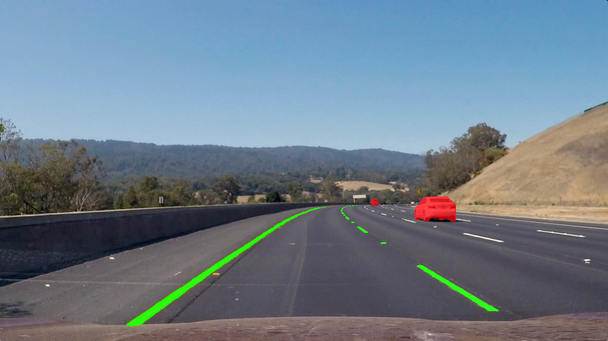

Currently working on this project.

Using deep learning(semantic segmentation) to locate lane and vehicle in relation to lane, determine radius of curves and vehicle distance from lane center

##### An Example of semantic segmentation

