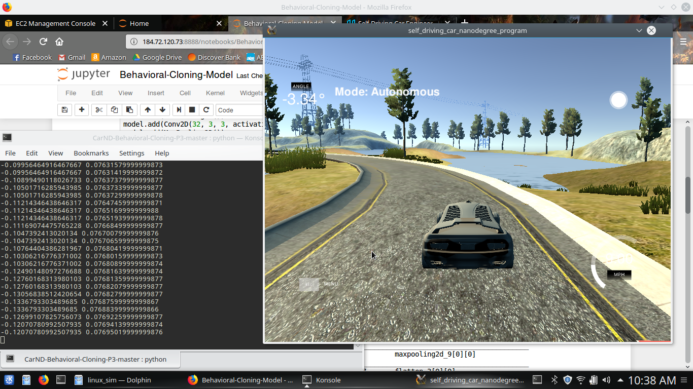

## Behavioral Cloning Project



The goals / steps of this project are the following:
* Use the Udacity provided simulator to collect data of good driving behavior
* Build a convolution neural network in Keras that predicts steering angles from images
* Train the model on an AWS GPU instance
* Test that the model successfully drives around track one without leaving the road
* Summarize the results with a written report


#### My project includes the following files:
* Model.ipynb containing the script to create and train the model
* model.h5 containing a trained convolution neural network 
* writeup_report.md summarizing the results
* run1.mp4 documenting the performance of the model on track 1.
* run2.mp4 documenting the performance of the model on track 2.
* drive.py Udacity provided script for running the simulator in autonomous mode

#### Instructions:

Using the Udacity provided simulator and drive.py file, and my model.h5, the car can be driven autonomously around the track by executing 
```sh
python drive.py model.h5
```
and then opening the simulator and selecting "autonomous mode".

---

The model.ipynb file contains the code for training and saving the convolution neural network. The file shows the pipeline I used for training and validating the model, and it contains comments to explain how the code works.

#### Model:

The final model architecture consisted of a convolution neural network with the following layers:

| Layer         		|     Description	        					| 
|:---------------------:|:---------------------------------------------:| 
| Lambda         		| Normalization and centering  					| 
| Convolution 3x3     	| depth 16 	|
| RELU					|												|
| Max pooling	      	| 2x2 stride 		    		|
| Convolution 3x3	    | depth 32	|
| RELU                  |                                               |
| Max pooling	      	| 2x2 stride 		    		|
| Convolution 3x3     	| depth 64 	|
| RELU					|												|
| Max pooling	      	| 2x2 stride 		    		|
| Flatten	      	| 	    		|
| Dense         | Single node |

#### Attempts to reduce overfitting in the model

The amount and variety of training data was carefully chosen to avoid overfitting.

The model was trained and validated on different data sets to ensure that the model was not overfitting. The model was tested by running it in the simulator and ensuring that the vehicle could stay on the track in track 1, and that it could generalize to track 2.

#### Model parameter tuning

The model used an adam optimizer, so the learning rate was not tuned manually.

#### Appropriate training data

Training data was chosen to keep the vehicle driving on the road. I used a combination of center lane driving, recovering from the left and right sides of the road, as well as additional passes over challenging corners. I traversed the track counter-clockwise and clockwise equally to avoid a bias to turning one direction.

For details about how I created the training data, see the next section. 

### Model Architecture and Training Strategy

#### 1. Solution Design Approach

The overall strategy for deriving a model architecture was to build a model that could understand a scene to make a decision based on it.

My first step was to use a convolution neural network model with three conv2d 3x3 layers with depth increasing from 16 to 64. I thought this model might be appropriate because it has excelled in many previous computer vision projects. Its three layers provide good levels of features for accuracy and speed.

In order to gauge how well the model was working, I split my image and steering angle data into a training and validation set. The model learned perfectly right away, both the training and validation accuracy were < .01.

However, in autonomous mode it was clear that the model had not learned enough information from the dataset, and it did not follow the lane.

I gathered more training data on track 1, bringing my training set up to two laps in both directions. I also added a lap in both directions on the second track, to help the model learn to generalize.

There were still a few spots where the vehicle fell off the track, such as the corner after the bridge where the curb is dirt. To solve this, I added training data for the few spots that it struggled.

At the end of the process, the vehicle is able to drive autonomously around track 1 without leaving the road, and can navigate all but the three sharpest corners of the more difficult track 2.


#### 3. Creation of the Training Set & Training Process

To capture good driving behavior, I first recorded one lap in both directions on track 1 using center lane driving. I then recorded one more lap in both directions, including some recoveries from the edges to teach what to do in case it gets off course.
In addition I gathered data on track 2 to enable better generalization.
Finally, I added some data from specific places that the model struggled with.
After the final collection process, I had ~10,000 data points.

I finally randomly shuffled the data set and put 20% of the data into a validation set. 

I used this training data for training the model. The validation set helped determine if the model was over or under fitting. I used a callback to epoch with the best validation score. I used an adam optimizer so that manually training the learning rate wasn't necessary.

I loaded the data and jupyter notebook onto an AWS GPU-enabled EC2 instance to carry out the training, and retreived the saved model once the training was complete.
